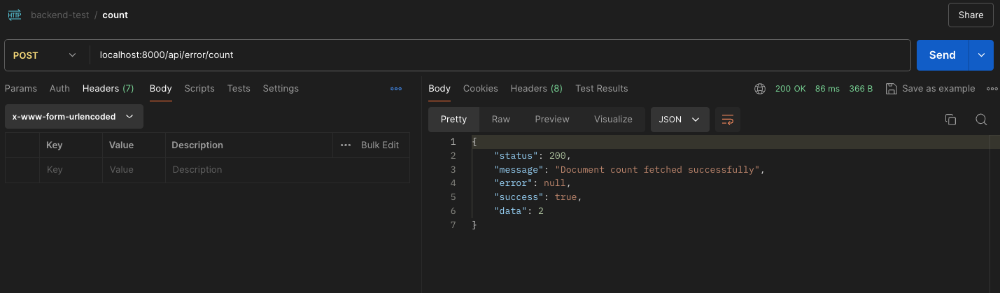
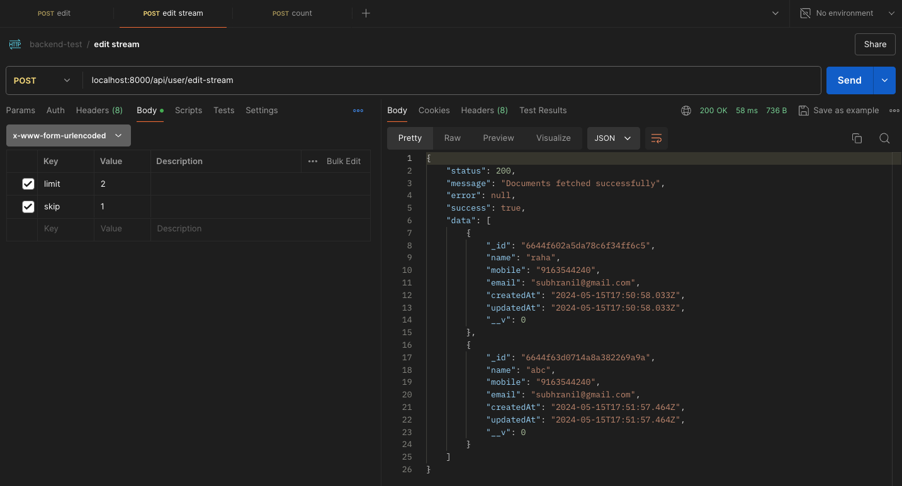
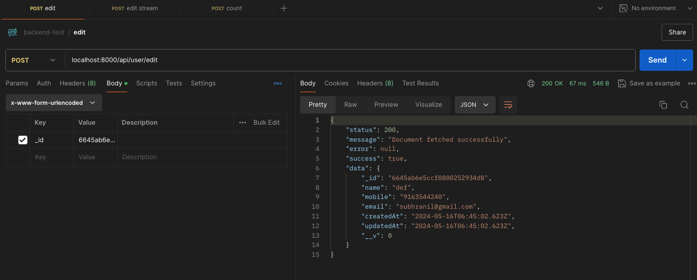

# Server README

## Overview

This server is designed to handle API requests for various models using a generative function approach to create routes dynamically. The server establishes routes for editing, editing streams, counting, and creating documents for different models.

## Table of Contents
1. [Setup](#setup)
2. [Environment Variables](#environment-variables)
4. [Routes](#routes)
6. [Controllers](#controllers)
7. [Model Selector](#model-selector)
8. [Starting the Server](#starting-the-server)
9. [API Request Handling Examples](#api-request-handling-examples)

## Setup

To set up the server, follow these steps:

1. Clone the repository.
2. Install the dependencies using `npm install`.
3. Set up environment variables as described below.

## Environment Variables

Change sample.env to .env and paste below the required environment varialbes. The server requires the following environment variables:

- `PORT`: The port on which the server will run (default: 8080).
- `MONGO_URL`: The URL for connecting to the MongoDB database.


## Routes

### Dynamic Routes

The server dynamically creates routes for various models which can defined in `/src/controllers/controller-builders`. These routes include:

- **Edit a document**: `POST /api/:model/edit/`
- **Edit a stream**: `POST /api/:model/edit-stream`
- **Count documents**: `POST /api/:model/count`
- **Create a document**: `POST /api/:model/create`

### Custom Routes

Custom routes can be defined for specific functionalities related to the model under `/src/controllers/` :

- **User routes**: `/api/user`
- **Notification routes**: `/api/notification`
- **Error routes**: `/api/error`

## Controllers

Controllers-Builders handle the route logic for each model. Example edit controller:

```typescript
import { NextFunction, Request, Response } from "express";
import { modelSelector } from "../../utils/model-selector";

export const editController = async (req: Request, res: Response, next: NextFunction) => {
    try {
        const { model } = req.params;
        const query = req.body;
        const Model = modelSelector(model as keyof typeof models);
        const document = await Model.findOne(query).exec();
        if (!document) {
            return res.status(404).json({
                status: 404,
                message: "Document not found",
                success: false,
                data: null
            });
        }
        res.status(200).json({
            status: 200,
            message: "Document fetched successfully",
            success: true,
            data: document
        });
    } catch (error) {
        res.status(500).json({
            status: 500,
            message: "Internal Server Error",
            success: false,
            error: error,
            data: null
        });
    }
};
```

## Model Selector

The `modelSelector` function under `src/utils` dynamically selects the appropriate Mongoose model based on the model name provided in the route parameter.

```typescript
import { Model } from "mongoose";
import UserModel, { IUser } from "../models/user";
import NotificationModel, { INotification } from "../models/notification";
import ErrorModel, { IError } from "../models/error";

interface IModels {
    user: Model<IUser>,
    notification: Model<INotification>,
    error: Model<IError>
}

export const models: IModels = {
    user: UserModel,
    notification: NotificationModel,
    error: ErrorModel
};

export const modelSelector = (modelName: keyof typeof models) => {
    const model = models[modelName];
    if (!model) {
        throw new Error("No such model exists");
    }
    return model;
};
```

## Starting the Server

To start the server, ensure that MongoDB is running and the environment variables are set up. Then, run:

```bash
npm run dev
```

You should see a message indicating that the MongoDB connection was successful and that the server has started on the specified port.

## API Request Handling Output

Here are some examples of successful API requests using Postman:

### Count Documents

**Endpoint**: `POST /api/error/count`

**Response**:
```json
{
  "status": 200,
  "message": "Document count fetched successfully",
  "error": null,
  "success": true,
  "data": 2
}
```
**Screenshot**:


### Edit Stream

**Endpoint**: `POST /api/user/edit-stream`

**Body**:
```json
{
  "limit": 2,
  "skip": 1
}
```

**Response**:
```json
{
  "status": 200,
  "message": "Documents fetched successfully",
  "error": null,
  "success": true,
  "data": [
    {
      "_id": "6644f602a5da78c6f34ff6c5",
      "name": "raha",
      "mobile": "9163544240",
      "email": "subhranil@gmail.com",
      "createdAt": "2024-05-15T17:50:58.033Z",
      "updatedAt": "2024-05-15T17:50:58.033Z",
      "__v": 0
    },
    {
      "_id": "6644f63d0714a8a382a69a9a",
      "name": "abc",
      "mobile": "9163544240",
      "email": "subhranil@gmail.com",
      "createdAt": "2024-05-15T17:51:57.464Z",
      "updatedAt": "2024-05-15T17:51:57.464Z",
      "__v": 0
    }
  ]
}
```
**Screenshot**:


### Edit Document

**Endpoint**: `POST /api/user/edit`

**Body**:
```json
{
  "_id": "6645ab6e5ccf0800252934d8"
}
```

**Response**:
```json
{
  "status": 200,
  "message": "Document fetched successfully",
  "error": null,
  "success": true,
  "data": {
    "_id": "6645ab6e5ccf0800252934d8",
    "name": "def",
    "mobile": "9163544240",
    "email": "subhranil@gmail.com",
    "createdAt": "2024-05-16T06:45:02.623Z",
    "updatedAt": "2024-05-16T06:45:02.623Z",
    "__v": 0
  }
}
```
**Screenshot**:
